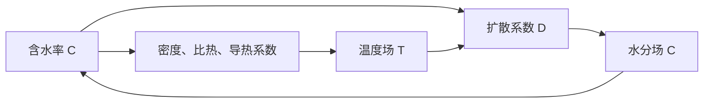

# A 题第二问：在第一问基础上的建模与实现

## 1. 第二问与第一问的关系

第一问已经建立固定圆柱内的一维径向传热—传质模型，其基本结构为

$$
\rho c_p\frac{\partial T}{\partial t}
=
\frac{1}{r}\frac{\partial}{\partial r}
\left(rk\frac{\partial T}{\partial r}\right),
$$

$$
\frac{\partial C}{\partial t}
=
\frac{1}{r}\frac{\partial}{\partial r}
\left[rD\frac{\partial C}{\partial r}\right].
$$

第二问不改变能量守恒、质量守恒、中心对称和表面对流传递这些基本原理，而是将第一问的常物性模型升级为变物性非线性模型：

$$
\rho=\rho(C),
\qquad
c_p=c_p(C),
\qquad
k=k(C),
\qquad
D=D(C,T).
$$

因此，第二问的递进关系为

$$
\text{第一问：固定物性或弱非线性}
\quad\longrightarrow\quad
\text{第二问：变物性、双向热湿耦合}.
$$

第二问应从 $t=0$、$T=28\,{}^\circ\mathrm{C}$、$C=2.55$ 重新计算，并在预热平衡与恒温干燥阶段统一使用附录 3 的经验公式。不能先用第一问参数计算 $0\sim1800\,\mathrm{s}$，再从 $1800\,\mathrm{s}$ 切换到附录 3，否则不符合题目“相关经验公式统一采用附录 3”的要求。

第一问的详细守恒方程推导、边界符号约定和有限体积思想见[第一问解答思路与公式推导](./第一问解答思路与公式推导.md)。本文重点说明第二问新增的变物性耦合与数值实现。

## 2. 研究区域与变量

药材半径和长度仍取

$$
R=0.02\,\mathrm{m},
\qquad
L=0.25\,\mathrm{m}.
$$

第二问暂不考虑尺寸收缩，计算区域为

$$
0\le r\le R,
\qquad
0\le t\le10800\,\mathrm{s}.
$$

其中 $10800\,\mathrm{s}=3\,\mathrm{h}$。

定义：

- $T(r,t)$：药材温度，计算与输出时使用 ${}^\circ\mathrm{C}$；
- $T_K(r,t)$：药材绝对温度，单位为 $\mathrm{K}$；
- $C(r,t)$：药材干基含水率，单位为 $\mathrm{kg/kg}$；
- $T_\infty(t)$：烘房温度；
- $C_\infty(t)$：烘房水分浓度。

摄氏温度与绝对温度的换算为

$$
\boxed{
T_K(r,t)=T(r,t)+273.15
}.
$$

## 3. 模型假设

在第一问假设的基础上，第二问采用以下假设：

1. 药材为均质、各向同性的圆柱体，关于中心轴旋转对称。
2. 只考虑径向传热和传质，忽略轴向梯度及端部效应。
3. 在前三小时内保持半径 $R=0.02\,\mathrm{m}$ 不变；尺寸变化留到第四问处理。
4. 药材内部不存在宏观物质对流，只考虑有效水分扩散。
5. 忽略辐射、内部热源、机械功以及蒸发潜热对能量方程的显式影响。
6. $\rho(C)$、$c_p(C)$、$k(C)$ 和 $D(C,T_K)$ 统一采用题目附录 3 的经验公式。
7. 表面对流换热系数和对流传质系数在第二问中保持不变。

题目附录 3 没有重新给出 $h$ 和 $h_m$。为了使问题闭合，本文沿用第一问给出的

$$
h=25\,\mathrm{W/(m^2\cdot K)},
\qquad
h_m=8\times10^{-7}\,\mathrm{m/s}.
$$

这是基于题目参数连续性的建模假设，应在论文中明确说明，而不能表述为“附录 3 给定”。

## 4. 烘房边界数据

附件 1 给出 $0\sim14400\,\mathrm{s}$ 的烘房温度和水分浓度，采样间隔为 $60\,\mathrm{s}$。第二问只计算前三小时，即

$$
0\le t\le10800\,\mathrm{s},
$$

因此全部计算时间都在附件 1 的数据范围内，不需要对环境条件进行超范围外推。

设附件 1 中的采样时刻为

$$
t_j=60j.
$$

对于 $t\in[t_j,t_{j+1}]$，采用分段线性插值：

$$
T_\infty(t)
=T_{\infty,j}
+\frac{t-t_j}{60}
\left(T_{\infty,j+1}-T_{\infty,j}\right),
$$

$$
C_\infty(t)
=C_{\infty,j}
+\frac{t-t_j}{60}
\left(C_{\infty,j+1}-C_{\infty,j}\right).
$$

附件 1 中的环境曲线本身描述了烘房从预热状态逐渐进入近似恒温状态的过程，因此不需要在程序中人为设置一个不连续的“阶段切换时刻”。

## 5. 附录 3 的变物性关系

题目附录 3 给出

$$
\boxed{
\rho(C)=650+128C
}
\quad \mathrm{kg/m^3},
$$

$$
\boxed{
c_p(C)=1450+2736\frac{C}{C+1}
}
\quad \mathrm{J/(kg\cdot K)},
$$

$$
\boxed{
k(C)=0.21+0.38\frac{C}{C+1}
}
\quad \mathrm{W/(m\cdot K)},
$$

$$
\boxed{
D(C,T_K)
=2.4\times10^{-3}
\exp\!\left(-\frac{0.45}{C}\right)
\exp\!\left(-\frac{3850}{T_K}\right)
}
\quad \mathrm{m^2/s}.
$$

其中扩散系数公式中的温度必须为绝对温度 $T_K$。如果把摄氏温度直接代入 $\exp(-3850/T)$，会导致扩散系数出现严重的数量级错误。

上述四个经验公式的直接出处均为[A 题题面附录 3](./A题.pdf)，不是由 Fourier 定律或 Fick 定律推导得到的。

## 6. 变物性温度方程

### 6.1 能量守恒形式

由第一问的圆柱微元能量守恒，在没有内部热源时有

$$
\rho c_p\frac{\partial T}{\partial t}
=
\frac{1}{r}\frac{\partial}{\partial r}
\left(rk\frac{\partial T}{\partial r}\right).
$$

第二问中各物性随含水率变化，因此控制方程应写为

$$
\boxed{
\rho(C)c_p(C)
\frac{\partial T}{\partial t}
=
\frac{1}{r}\frac{\partial}{\partial r}
\left[
rk(C)\frac{\partial T}{\partial r}
\right]
}.
$$

该式采用题目意图下的“瞬时有效热容”模型，即将 $\rho(C)c_p(C)$ 作为当前状态下的体积热容。若从严格混合物焓守恒出发，含水率变化还可能引入组成焓项和蒸发潜热项，但题目没有给出相应参数，因此第二问不额外引入这些无法辨识的项。

### 6.2 为什么不能把 $k(C)$ 移出导数

由于 $k$ 是 $C$ 的函数，空间上通常不均匀，所以

$$
\frac{1}{r}\frac{\partial}{\partial r}
\left[rk(C)T_r\right]
\ne
k(C)\left(T_{rr}+\frac{1}{r}T_r\right).
$$

将其展开可得

$$
\frac{1}{r}\frac{\partial}{\partial r}
\left[rk(C)T_r\right]
=
k(C)\left(T_{rr}+\frac{1}{r}T_r\right)
+\frac{\mathrm{d}k}{\mathrm{d}C}C_rT_r.
$$

由

$$
k(C)=0.21+0.38\frac{C}{C+1}
$$

得到

$$
\frac{\mathrm{d}k}{\mathrm{d}C}
=\frac{0.38}{(C+1)^2}.
$$

因此温度方程的非守恒展开形式为

$$
\rho(C)c_p(C)T_t
=
k(C)\left(T_{rr}+\frac{1}{r}T_r\right)
+\frac{0.38}{(C+1)^2}C_rT_r.
$$

数值求解时应保留原来的通量守恒形式，而不使用展开式。

## 7. 变扩散系数水分方程

由 Fick 定律和圆柱微元质量守恒，第一问已经得到

$$
C_t
=
\frac{1}{r}\frac{\partial}{\partial r}
\left(rDC_r\right).
$$

第二问的扩散系数同时依赖 $C$ 和 $T_K$，故

$$
\boxed{
\frac{\partial C}{\partial t}
=
\frac{1}{r}\frac{\partial}{\partial r}
\left[
rD(C,T_K)\frac{\partial C}{\partial r}
\right]
}.
$$

若完全展开，有

$$
C_t
=
D\left(C_{rr}+\frac{1}{r}C_r\right)
+D_C(C_r)^2
+D_TT_rC_r,
$$

其中

$$
D_C=\frac{\partial D}{\partial C}
=D(C,T_K)\frac{0.45}{C^2},
$$

$$
D_T=\frac{\partial D}{\partial T_K}
=D(C,T_K)\frac{3850}{T_K^2}.
$$

因为 $T_K=T+273.15$，所以

$$
\frac{\partial T_K}{\partial r}
=\frac{\partial T}{\partial r}.
$$

展开式显示了第二问中的直接耦合：温度梯度会通过 $D_TT_rC_r$ 影响水分迁移。不过，为保证数值守恒，程序仍应使用

$$
\frac{1}{r}\frac{\partial}{\partial r}(rDC_r)
$$

这一守恒形式。

## 8. 初始条件和边界条件

### 8.1 初始条件

第二问从烘干开始时重新计算：

$$
\boxed{
T(r,0)=28\,{}^\circ\mathrm{C},
\qquad
C(r,0)=2.55
},
\qquad 0\le r\le R.
$$

### 8.2 中心对称条件

$$
\boxed{
\left.\frac{\partial T}{\partial r}\right|_{r=0}=0,
\qquad
\left.\frac{\partial C}{\partial r}\right|_{r=0}=0
}.
$$

### 8.3 表面对流换热条件

由于表面导热系数随表面含水率变化，边界条件为

$$
\boxed{
k(C_s)
\left.\frac{\partial T}{\partial r}\right|_{r=R}
=
h\left[T_\infty(t)-T_s(t)\right]
},
$$

其中

$$
T_s(t)=T(R,t),
\qquad
C_s(t)=C(R,t).
$$

### 8.4 表面对流传质条件

$$
\boxed{
D(C_s,T_{K,s})
\left.\frac{\partial C}{\partial r}\right|_{r=R}
=
h_m\left[C_\infty(t)-C_s(t)\right]
},
$$

其中

$$
T_{K,s}(t)=T_s(t)+273.15.
$$

## 9. 第二问的完整数学模型

综合以上分析，第二问模型为

$$
\boxed{
\begin{cases}
\displaystyle
\rho(C)c_p(C)\frac{\partial T}{\partial t}
=
\frac{1}{r}\frac{\partial}{\partial r}
\left[rk(C)\frac{\partial T}{\partial r}\right],
&0<r<R,\quad 0<t\le10800,\\[2mm]
\displaystyle
\frac{\partial C}{\partial t}
=
\frac{1}{r}\frac{\partial}{\partial r}
\left[rD(C,T_K)\frac{\partial C}{\partial r}\right],
&0<r<R,\quad 0<t\le10800,\\[2mm]
T(r,0)=28,\qquad C(r,0)=2.55,
&0\le r\le R,\\[1mm]
\displaystyle
T_r(0,t)=0,\qquad C_r(0,t)=0,
&0<t\le10800,\\[1mm]
\displaystyle
k(C_s)T_r(R,t)
=h[T_\infty(t)-T_s(t)],
&0<t\le10800,\\[1mm]
\displaystyle
D(C_s,T_{K,s})C_r(R,t)
=h_m[C_\infty(t)-C_s(t)],
&0<t\le10800.
\end{cases}
}
$$

物性关系为

$$
\rho(C)=650+128C,
$$

$$
c_p(C)=1450+2736\frac{C}{C+1},
$$

$$
k(C)=0.21+0.38\frac{C}{C+1},
$$

$$
D(C,T_K)
=2.4\times10^{-3}
\exp\!\left(-\frac{0.45}{C}\right)
\exp\!\left(-\frac{3850}{T_K}\right).
$$

## 10. 热湿耦合关系

第二问的耦合链条为



具体而言：

1. 当前含水率决定 $\rho(C)$、$c_p(C)$ 和 $k(C)$；
2. 这些物性决定下一次迭代的温度场；
3. 当前含水率和更新后的绝对温度共同决定 $D(C,T_K)$；
4. 扩散系数决定下一次迭代的含水率；
5. 新含水率再次影响温度方程中的物性。

因此第二问不能将温度场和水分场分别一次性求解，而应在每个时间步内进行耦合迭代。

## 11. 有限体积离散

### 11.1 空间与时间网格

沿用第一问的径向节点：

$$
r_i=i\Delta r,
\qquad i=0,1,\ldots,N.
$$

为直接满足输出要求，可以取

$$
\Delta r=0.001\,\mathrm{m},
\qquad N=20,
$$

但为了降低空间离散误差，推荐实际计算采用

$$
\Delta r=0.0005\,\mathrm{m},
\qquad N=40,
$$

再每隔两个计算节点提取一次结果。时间步长取

$$
\Delta t=1\,\mathrm{s},
$$

与结果文件要求一致。

定义径向控制体权重

$$
M_i
=\int_{r_{i-1/2}}^{r_{i+1/2}}r\,\mathrm{d}r
=\frac{r_{i+1/2}^2-r_{i-1/2}^2}{2}.
$$

### 11.2 统一离散形式

将两组方程写成统一形式

$$
S(\boldsymbol y)
\frac{\partial\phi}{\partial t}
=
\frac{1}{r}\frac{\partial}{\partial r}
\left[r\Gamma(\boldsymbol y)\frac{\partial\phi}{\partial r}\right],
$$

其中

$$
(\phi,S,\Gamma)
=
\begin{cases}
(T,\rho(C)c_p(C),k(C)),&\text{温度方程},\\
(C,1,D(C,T_K)),&\text{水分方程}.
\end{cases}
$$

对内部控制体积分，并使用后向 Euler 全隐格式，得到

$$
\boxed{
S_i^{n+1}M_i
\frac{\phi_i^{n+1}-\phi_i^n}{\Delta t}
=
r_{i+1/2}\Gamma_{i+1/2}^{n+1}
\frac{\phi_{i+1}^{n+1}-\phi_i^{n+1}}{\Delta r}
-r_{i-1/2}\Gamma_{i-1/2}^{n+1}
\frac{\phi_i^{n+1}-\phi_{i-1}^{n+1}}{\Delta r}
}.
$$

由于 $S$ 和 $\Gamma$ 依赖未知的 $T^{n+1}$、$C^{n+1}$，该式是非线性代数方程组。

### 11.3 界面物性

为了保证相邻控制体界面的通量连续，建议使用调和平均：

$$
k_{i+1/2}
=\frac{2k_ik_{i+1}}{k_i+k_{i+1}},
$$

$$
D_{i+1/2}
=\frac{2D_iD_{i+1}}{D_i+D_{i+1}}.
$$

所有物性均应由当前非线性迭代值计算，不能在 $t=0$ 时计算一次后保持不变。

### 11.4 中心节点

在 $r=0$ 处利用对称性，离散式为

$$
\boxed{
S_0^{n+1}
\frac{\phi_0^{n+1}-\phi_0^n}{\Delta t}
=
\frac{4\Gamma_{1/2}^{n+1}}{\Delta r^2}
\left(\phi_1^{n+1}-\phi_0^{n+1}\right)
}.
$$

### 11.5 表面节点

表面半控制体的径向权重为

$$
M_N
=\frac{R^2-(R-\Delta r/2)^2}{2}.
$$

表面节点离散式为

$$
\boxed{
S_N^{n+1}M_N
\frac{\phi_N^{n+1}-\phi_N^n}{\Delta t}
=
Rb\left(\phi_\infty^{n+1}-\phi_N^{n+1}\right)
-r_{N-1/2}\Gamma_{N-1/2}^{n+1}
\frac{\phi_N^{n+1}-\phi_{N-1}^{n+1}}{\Delta r}
},
$$

其中

$$
b=
\begin{cases}
h,&\phi=T,\\
h_m,&\phi=C.
\end{cases}
$$

这一处理把对流边界直接纳入表面控制体守恒式，避免额外构造虚拟节点。

## 12. 每个时间步的非线性耦合迭代

推荐采用分块 Picard 迭代。由 $t_n$ 推进至 $t_{n+1}$ 时：

### 步骤 1：初值预测

$$
T_i^{(0)}=T_i^n,
\qquad
C_i^{(0)}=C_i^n.
$$

### 步骤 2：更新热物性

第 $m$ 次迭代中，由 $C_i^{(m)}$ 计算

$$
\rho_i^{(m)},
\qquad
c_{p,i}^{(m)},
\qquad
k_i^{(m)}.
$$

### 步骤 3：求解温度方程

固定当前热物性，求解三对角线性方程组，得到临时温度

$$
T_i^*.
$$

### 步骤 4：更新扩散系数

先转换为绝对温度

$$
T_{K,i}^*=T_i^*+273.15,
$$

再计算

$$
D_i^{(m)}
=D\left(C_i^{(m)},T_{K,i}^*\right).
$$

### 步骤 5：求解水分方程

固定当前扩散系数，求解水分方程，得到

$$
C_i^*.
$$

### 步骤 6：松弛更新

为提高强非线性情况下的稳定性，可以采用

$$
T_i^{(m+1)}
=\omega_TT_i^*+(1-\omega_T)T_i^{(m)},
$$

$$
C_i^{(m+1)}
=\omega_CC_i^*+(1-\omega_C)C_i^{(m)},
$$

其中通常可先取

$$
\omega_T=\omega_C=1.
$$

若迭代出现振荡，再将松弛因子减小到 $0.5\sim0.8$。

### 步骤 7：判断收敛

例如使用

$$
\max_i
\left|T_i^{(m+1)}-T_i^{(m)}\right|
<10^{-8},
$$

$$
\max_i
\left|C_i^{(m+1)}-C_i^{(m)}\right|
<10^{-10}.
$$

两项同时满足时，令

$$
T_i^{n+1}=T_i^{(m+1)},
\qquad
C_i^{n+1}=C_i^{(m+1)}.
$$

若达到最大迭代次数仍不收敛，应缩小时间步，而不能直接接受未收敛结果。

## 13. 实现伪代码

```text
读取附件1
构造 T_inf(t)、C_inf(t) 的分段线性插值

建立径向网格 r_i
初始化 T_i = 28，C_i = 2.55

for n = 0, 1, ..., 10799:
    t_new = (n + 1) s
    计算 T_inf(t_new)、C_inf(t_new)

    T_iter = T_old
    C_iter = C_old

    for m = 0, 1, ..., max_iter:
        rho = 650 + 128*C_iter
        cp  = 1450 + 2736*C_iter/(C_iter + 1)
        k   = 0.21 + 0.38*C_iter/(C_iter + 1)

        组装并求解温度三对角方程组，得到 T_star

        T_kelvin = T_star + 273.15
        D = 2.4e-3*exp(-0.45/C_iter)*exp(-3850/T_kelvin)

        组装并求解水分三对角方程组，得到 C_star

        对 T_star、C_star 进行必要的松弛

        if 温度增量和含水率增量均小于容差:
            break

        更新 T_iter、C_iter

    保存 t_new 时刻的 T、C

提取论文表3、表4所需数据
写入 result2.xlsx
```

程序中应检查

$$
C_i>0,
\qquad
T_i+273.15>0,
$$

避免指数公式出现无意义输入。正常物理解不应触及这些限制，因此保护措施只用于捕捉程序错误，不应用于掩盖数值发散。

## 14. 结果提取与 `result2.xlsx`

论文表 3 和表 4 要求的时间为

$$
t=0.5,1.0,1.5,2.0,2.5,3.0\,\mathrm{h},
$$

换算为秒为

$$
t=1800,3600,5400,7200,9000,10800\,\mathrm{s}.
$$

空间位置为

$$
r=0,0.5,1.0,1.5,2.0\,\mathrm{cm}.
$$

`result2.xlsx` 中应包含两个工作表：

- `温度`：保存 $T(r,t)$；
- `水分浓度`：保存 $C(r,t)$。

两个工作表均采用：

- A 列为时间，单位为 $\mathrm{s}$；
- 第 1 行为到药材中心的径向距离，单位为 $\mathrm{cm}$；
- 时间行为 $1,2,\ldots,10800\,\mathrm{s}$；
- 空间列为 $0,0.1,0.2,\ldots,2.0\,\mathrm{cm}$。

内部计算应保留双精度，只在最终写入 Excel 和论文表格时四舍五入到四位小数。

## 15. 数值验证

### 15.1 物性公式验证

每个时间步检查

$$
\rho_i>0,
\qquad
c_{p,i}>0,
\qquad
k_i>0,
\qquad
D_i>0.
$$

同时随机抽取若干节点，直接用附录 3 公式复算物性，防止单位或括号实现错误。

### 15.2 温标验证

扩散系数必须使用

$$
T_K=T+273.15.
$$

建议在初始时刻手工计算一个节点的 $D(2.55,301.15)$，与程序输出核对。

### 15.3 守恒验证

对本文采用的瞬时有效热容方程，在任意时刻对整个圆柱截面积分，可得

$$
2\pi L\int_0^R
\rho(C)c_p(C)
\frac{\partial T}{\partial t}
r\,\mathrm{d}r
=
2\pi RLh[T_\infty(t)-T_s(t)].
$$

注意，由于 $\rho$ 和 $c_p$ 随 $C$ 变化，一般不能将左端擅自改写为

$$
\frac{\mathrm{d}}{\mathrm{d}t}
\left[
2\pi L\int_0^R\rho(C)c_p(C)T(r,t)r\,\mathrm{d}r
\right].
$$

最直接的离散验证方法是逐控制体比较 $\rho c_p\,\Delta T/\Delta t$ 储存项与净热通量，并检查所有内部界面通量是否成对抵消。

水分场应满足

$$
\frac{\mathrm{d}}{\mathrm{d}t}
\left[
2\pi L\int_0^RC(r,t)r\,\mathrm{d}r
\right]
=
-2\pi RLh_m[C_s(t)-C_\infty(t)].
$$

### 15.4 物理方向验证

预热阶段通常应有

$$
T(R,t)\ge T(0,t),
$$

干燥阶段通常应有

$$
C(0,t)\ge C(R,t).
$$

若径向分布方向相反，应优先检查表面对流边界的正负号。

### 15.5 网格与时间步收敛

建议至少比较以下三组计算：

$$
(\Delta r,\Delta t)
=(0.001\,\mathrm{m},1\,\mathrm{s}),
$$

$$
(\Delta r,\Delta t)
=(0.0005\,\mathrm{m},1\,\mathrm{s}),
$$

$$
(\Delta r,\Delta t)
=(0.0005\,\mathrm{m},0.5\,\mathrm{s}).
$$

在表 3、表 4 指定的时间和空间位置比较结果。如果加密前后的最大差已经小于四位小数所需的精度，再采用较粗方案输出正式结果。

### 15.6 与第一问交叉验证

在 $0\sim1800\,\mathrm{s}$ 内，将第二问结果与第一问结果比较。两者不应完全相同，因为物性模型已经改变；但应具有相同的物理趋势：

- 温度从表面向中心逐渐升高；
- 水分从表面向中心逐渐降低；
- 解保持连续且不出现非物理振荡。

若两问结果差异极端，应检查：

1. 是否错误使用摄氏温度计算 $D$；
2. 是否遗漏指数函数括号；
3. 是否将变系数错误地移出空间导数；
4. 是否在第二问中错误沿用了第一问的常物性。

## 16. 第二问的主要难点

第二问的算力需求很低。即使采用 $41$ 个径向节点、$10800$ 个时间步和若干次 Picard 迭代，普通计算机也可以快速完成。

真正的难点是：

1. 正确理解附录 3 经验式并处理温度单位；
2. 保留变系数方程的守恒形式；
3. 在每个时间步内完成温度—水分耦合迭代；
4. 保证边界条件、非线性收敛和结果文件格式正确；
5. 明确第二问从 $t=0$ 重新计算，而不是拼接第一问结果。

因此第二问主要是数值算法和模型实现难度，不是算力难度。

## 17. 参考文献与公式出处

[1] FOURIER J B J. *Théorie analytique de la chaleur*[M]. Paris: Firmin Didot, 1822. [ETH Zürich 原版数字化馆藏](https://www.e-rara.ch/zut/doi/10.3931/e-rara-19706).

[2] FICK A. Ueber Diffusion[J]. *Annalen der Physik*, 1855, 170(1): 59-86. [DOI: 10.1002/andp.18551700105](https://onlinelibrary.wiley.com/doi/10.1002/andp.18551700105).

[3] CRANK J. *The Mathematics of Diffusion*[M]. 2nd ed. Oxford: Clarendon Press, 1975: 2-5. 圆柱坐标扩散方程见第 1.3 节。[馆藏信息](https://biblio.neel.cnrs.fr/index.php?id=8642&lang_sel=fr_FR&lvl=notice_display).

[4] PATANKAR S V. *Numerical Heat Transfer and Fluid Flow*[M]. Washington: Hemisphere Publishing Corporation, 1980. 有限体积离散方法见第 3—4 章。[出版社页面](https://www.routledge.com/Numerical-Heat-Transfer-and-Fluid-Flow/Patankar/p/book/9780891165224).

[5] COMSOL AB. Solid: Heat Conduction in Solids[EB/OL]. Fourier 定律、固体热方程和变物性设置见 [COMSOL 6.4 官方文档](https://doc.comsol.com/6.4/doc/com.comsol.help.comsol/comsol_ref_heattransfer.30.25.html).

[6] COMSOL AB. Effective Diffusivity in Porous Materials[EB/OL]. 扩散控制方程和外部对流传质边界见 [COMSOL 6.1 官方模型文档](https://doc.comsol.com/6.1/doc/com.comsol.help.models.mph.effective_diffusivity/models.mph.effective_diffusivity.pdf).

[7] 2026 年高教社杯全国大学生数学建模竞赛 A 题：药材的烘干问题[Z]. 第二问物性经验公式见 [本地题面附录 3](./A题.pdf).
